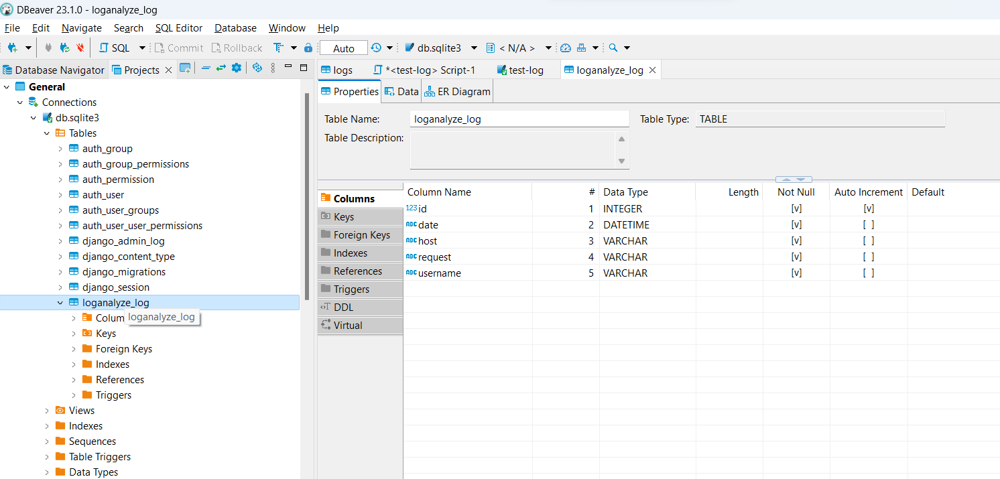

# python_django_groupby




## DJANGO реалізація.

```
> poetry init
> poetry shell
> poetry add django
> django-admin startproject groupby
> cd groupby
> python manage.py migrate
```

groupby\loganalyze\models.py:
```
class Log(models.Model):
    date = models.DateTimeField(default=timezone.now)
    host = models.CharField(max_length=128)
    request = models.CharField(max_length=128)
    username = models.CharField(max_length=128)

    class Meta:
        indexes = [
            models.Index(fields=["host"], name="host_idx")
        ]
```

```
> python manage.py makemigrations
Migrations for 'loganalyze':
  loganalyze\migrations\0001_initial.py
    - Create model Log

> python manage.py migrate
Operations to perform:
  Apply all migrations: admin, auth, contenttypes, loganalyze, sessions
Running migrations:
  Applying loganalyze.0001_initial... OK 
```

## Import DATA. DBeaver


Add index.template: groupby\loganalyze\templates\loganalyze\index.html

## Django view

```
<!DOCTYPE html>
<html lang="en">
<head>
    <meta charset="UTF-8">
    <meta name="viewport" content="width=device-width, initial-scale=1.0">
    <title>Index GroupBy</title>
</head>
<body>
  <h1>HELLO GroupBy</h1>
</body>
</html>
```


groupby\loganalyze\views.py:
```
from django.shortcuts import render


# Create your views here.
def main(request):
    return render(request, 'loganalyze/index.html')
```

groupby\loganalyze\urls.py:

```
from django.urls import path
from . import views

app_name = 'loganalyze'

urlpatterns = [
    path('', views.main, name='main'),
]
```

groupby\groupby\urls.py:

```
from django.contrib import admin
from django.urls import include, path

urlpatterns = [
    path("admin/", admin.site.urls),
    path('', include('loganalyze.urls')),
]
```

```
> python manage.py runserver
Watching for file changes with StatReloader
Performing system checks...

System check identified no issues (0 silenced).
December 03, 2023 - 19:38:03
Django version 4.2.7, using settings 'groupby.settings'
Starting development server at http://127.0.0.1:8000/
Quit the server with CTRL-BREAK.
```


#### Add value:
```
from django.shortcuts import render
from .models import Log

# Create your views here.
def main(request):
    data = Log.objects.all()
    context=  {"data":data}
    return render(request, 'loganalyze/index.html', context=context)
```

Tune template:
```
  <table class="table table-sm table-bordered table-striped col-auto">
    <thead>
      <tr>
        <th scope="col">id</th>
        <th scope="col">date</th>
        <th scope="col">host</th>
        <th scope="col">request</th>
        <th scope="col">username</th>
      </tr>
    </thead>
    <tbody>
      
      <tr>
        <th scope="row">{{row.id}}</td>
        <td>{{row.date}}</td>
        <td>{{row.host}}</td>
        <td>{{row.request}}</td>
        <td>{{row.username}}</td>
      </tr>
      
    </tbody>
  </table>
```


#### View, search for user name "user1:
```
    data = Log.objects.filter(username__exact = "user1")
```


#### View, search username "user1" and group by "host" by use Django raw sql request:
```
    data = Log.objects.raw("SELECT x.* FROM loganalyze_log x WHERE x.username = %s GROUP BY x.host", ["user1"])

```


#### View, using Django non raw sql request, search for username "user1" and group by "host":
```
    # Filter "user1" only
    data0 = Log.objects.filter(username__exact = "user1")
    
    # Select from previous result only column with name 'host' and get unique value for it with 
    # calculate minimum value on 'id' column, it should be first raw only.
    grouped_records = data0.values('host').distinct().annotate(min_id=Min("id"))

    # From clear table select founded rows by founded "id" lists.
    data =  Log.objects.filter(id__in=grouped_records.values_list("min_id", flat=True))
```


#### Log Djano SQL: 
groupby\groupby\settings.py:
```
# logging
LOGGING = {
    "version": 1,
    "filters": {
        "require_debug_true": {
            "()": "django.utils.log.RequireDebugTrue",
        }
    },
    "handlers": {
        "console": {
            "level": "DEBUG",
            "filters": ["require_debug_true"],
            "class": "logging.StreamHandler",
        }
    },
    "loggers": {
        "django.db.backends": {
            "level": "DEBUG",
            "handlers": ["console"],
        }
    },
}
```


```
December 04, 2023 - 05:15:32
Django version 4.2.7, using settings 'groupby.settings'
Starting development server at http://127.0.0.1:8000/
Quit the server with CTRL-BREAK.

(0.000) SELECT "loganalyze_log"."id", "loganalyze_log"."date", "loganalyze_log"."host", "loganalyze_log"."request", "loganalyze_log"."username" FROM "loganalyze_log" WHERE "loganalyze_log"."id" IN (SELECT DISTINCT MIN(U0."id") AS "min_id" FROM "loganalyze_log" U0 WHERE U0."username" = 'user1' GROUP BY U0."host"); args=('user1',); alias=default


```